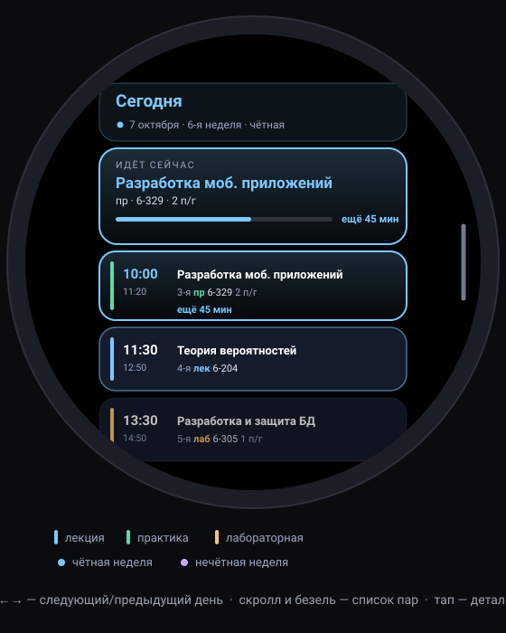

# 📅 Расписание КЭИ УлГТУ для Wear OS

Приложение для часов на Wear OS, которое показывает расписание группы **Пдп-21 (326), КЭИ УлГТУ**
в удобном для маленького экрана виде. Написано на **Kotlin + Jetpack Compose для Wear OS**.



---

## 💡 Главное: как «большая таблица» помещается в маленькие часы

Расписание в ЛК — это широкая таблица: 8 колонок пар × 7 строк дней, в каждой ячейке по
4–5 строк текста. На экране часов 1,4–1,9″ такая таблица нечитаема в принципе.
Поэтому приложение **не рисует таблицу**, а переупаковывает те же данные:

| Проблема таблицы | Решение в приложении |
| --- | --- |
| 8 колонок не влезают по ширине | Пара — это **карточка** на всю ширину экрана: слева крупно время начала/конца, справа предмет, тип, аудитория, подгруппа |
| 7 дней × 2 чётности = 14 вариантов недели | **Свайп влево/вправо** листает дни: сегодня, завтра, послезавтра… (14 дней = две учебные недели). Чётность недели определяется автоматически |
| Не видно, что идёт сейчас | Карточка **«ИДЁТ СЕЙЧАС»** сверху с обратным отсчётом до конца пары; текущая пара подсвечена рамкой, прошедшие — притушены, список сам прокручивается к текущему моменту |
| Шапки столбцов съедают место | Вместо шапок — изогнутая строка вверху (день, дата, чётность недели) и мини-шапка дня. Время пары всегда рядом с ней самой |
| Мелкий текст не читается | Крупное время (16 sp), жирный предмет (15 sp), детали (преподаватель, полный названия) — по тапу на карточку |

Навигация рассчитана на часы: **свайп по горизонтали** — смена дня, **вертикальный скролл /
вращение безеля** — прокрутка списка пар (элементы по краям круглого экрана уменьшаются —
эффект ScalingLazyColumn), **тап** — раскрыть детали пары.

## ✨ Что умеет

- ✅ Реальное расписание группы Пдп-21 (326) уже зашито в приложение
- ✅ **Автообновление** с публичного зеркала ЛК УлГТУ (timetable.житков.рф) — без логина;
  оригинальная ссылка `lk.ulstu.ru` требует входа в аккаунт, поэтому используется зеркало,
  куда выгружаются те же данные. Ручная кнопка «Обновить» — в конце списка
- ✅ Чётные/нечётные недели: номер недели и чётность считаются автоматически от начала семестра
- ✅ Подсветка текущей пары + обратный отсчёт, следующая пара с «через N мин»
- ✅ Офлайн-работа: последняя скачанная копия хранится на часах
- ✅ Поддержка круглых и квадратных экранов, безель, тёмная тема (по умолчанию)

## 🛠 Как собрать и установить

1. Установи **Android Studio** (Hedgehog или новее).
2. Открой папку проекта (`File → Open…` → корень репозитория) и дождись синхронизации Gradle.
   - В репозитории нет бинарного `gradle-wrapper.jar` (бинарники в git не кладут).
     Android Studio скачает Gradle 8.9 сам по `gradle/wrapper/gradle-wrapper.properties`.
     Если студия попросит — нажми **Fix Gradle wrapper / Use Gradle from: wrapper**.
     Для запуска из терминала можно выполнить `gradle wrapper` один раз.
3. Запусти:
   - **на эмуляторе**: `Device Manager → Create device → Wear OS` (круглый, например 1.4″);
   - **на часах**: включи «Для разработчиков» и «Отладку по ADB» на часах, затем
     `adb connect <IP:порт>` (или USB) и выбери часы в списке устройств → **Run ▶**.
   - APK собирается так: `./gradlew :app:assembleDebug`, готовый файл — `app/build/outputs/apk/debug/`.

Минимальная версия системы — **Wear OS 2.0 (API 26)**, т.е. работают и старые, и новые часы.

## 🔄 Откуда берётся расписание

При запуске (не чаще раза в 6 часов) и по кнопке «Обновить» приложение скачивает страницу
группы с зеркала `https://timetable.житков.рф/kei/326.html`, разбирает две таблицы
(текущая и следующая неделя) и сохраняет результат на часах.

- Сменилась группа? Поменяй адрес в `ScheduleSync.kt` (`SOURCE_URL`) —
  адреса всех групп есть на `https://timetable.житков.рф/kei/`.
- Номер учебной недели и начало семестра вычисляются автоматически из дат на странице,
  так что чётность недель не собьётся.
- Нет сети / зеркало недоступно — приложение работает на последних сохранённых данных
  (или на `assets/schedule.json` после установки).

## ✏️ Как отредактировать расписание вручную

Формат данных — `app/src/main/assets/schedule.json`:

```json
{
  "group": "Пдп-21 · группа 326",
  "college": "КЭИ УлГТУ",
  "semesterStart": "2026-08-31",     // понедельник 1-й недели семестра
  "bells": [ { "start": "08:30", "end": "09:50" }, "…всего 8 пар…" ],
  "days": {
    "mon": [
      {
        "week": "even",              // even | odd | all
        "pair": 3,                   // номер пары 1..8 (время берётся из bells)
        "subject": "Операционные системы и среды",
        "kind": "пр.",               // лек. | пр. | лаб.
        "subgroup": "1-я п/г",       // необязательно
        "teacher": "Агафонов Е С",
        "room": "1-113"
      }
    ],
    "tue": [], "wed": [], "thu": [], "fri": [], "sat": [], "sun": []
  }
}
```

- `week` — чётность недели: `"even"` (чётная), `"odd"` (нечётная) или `"all"` (каждую неделю).
- В одной ячейке может быть две подгруппы — просто добавь два элемента с одинаковым `pair`.
- После правки пересобери приложение: если файл изменился, он автоматически станет
  приоритетнее сохранённой синхронизации.
- Если JSON повреждён — приложение не упадёт, а откатится на последние сохранённые данные.

## 📁 Структура проекта

```
app/src/main/
├── assets/schedule.json              # расписание (реальные данные группы)
├── java/ru/sysanin/wearschedule/
│   ├── MainActivity.kt               # точка входа + фоновое обновление
│   ├── data/
│   │   ├── Models.kt                 # DTO (JSON) и доменные модели
│   │   ├── ScheduleRepository.kt     # хранение: assets / prefs / резерв
│   │   ├── MirrorParser.kt           # разбор HTML-страницы зеркала ЛК
│   │   └── ScheduleSync.kt           # сетевое обновление
│   ├── logic/ScheduleLogic.kt        # недели, чётность, статусы пар
│   └── ui/
│       ├── ScheduleApp.kt            # Scaffold + пейджер дней + TimeText
│       ├── DayPage.kt                # страница дня: шапка, «сейчас», список
│       ├── LessonCard.kt             # карточка пары
│       └── Components.kt             # общие компоненты
└── res/                              # иконка, тема, строки
```

Стек: Kotlin 2.0, Compose BOM 2024.09, **Wear Compose (material + foundation) 1.3.1**,
kotlinx.serialization, Jsoup. AGP 8.5, Gradle 8.9.

## 🩹 Частые проблемы (FAQ)

**«Cannot find a Java installation … Compatible with Java 21 (from gradle/gradle-daemon-jvm.properties)»**
Этот файл создаёт сама Android Studio (новые версии), проекту он не нужен:

1. В дереве проекта открой папку `gradle` → удали файл `gradle-daemon-jvm.properties`.
2. `File → Settings → Build, Execution, Deployment → Build Tools → Gradle` → поле **Gradle JVM** →
   выбери встроенную Java студии (`jbr-17` или `jbr-21`).
3. `File → Sync Project with Gradle Files`.

Альтернатива: установить JDK 21 (например, [Eclipse Temurin](https://adoptium.net/)) и выбрать его
в том же поле Gradle JVM. Проект работает и на Java 17, и на Java 21.

**Ошибки вида `Unresolved reference 'material3'` в файлах `com.example.…`, `ui/theme/Theme.kt`**
Это файлы другого проекта-шаблона, в которые скопирован код приложения. Так делать не нужно:
репозиторий — уже готовый проект. Открой через `File → Open` папку **с файлом `settings.gradle.kts`**
(корень репозитория, где лежат `app/`, `gradle/`, `README.md`), а не папку `app` и не сторонний проект.

**«Could not find gradle-wrapper.jar»**
Нормальная ситуация: бинарный jar в git не кладут. Android Studio скачает Gradle 8.9 сам
по `gradle/wrapper/gradle-wrapper.properties`. Для запуска из терминала один раз выполни `gradle wrapper`
или нажми **Fix Gradle wrapper** в окне ошибки.

## ⚠️ Известные ограничения

- Автообновление зависит от стороннего зеркала `timetable.житков.рф`. Если оно перестанет
  работать — расписание можно править вручную (см. выше).
- Зеркало показывает только текущую и следующую неделю, поэтому их данные экстраполируются
  на весь семестр по чётности недель (так устроено и само расписание УлГТУ).
- Экзаменационная сессия не входит в недельный шаблон — на время сессии расписание
  лучше обновлять вручную.

## 🚀 Идеи для развития

- Указать «свою» подгруппу и скрывать чужую
- Осложнение циферблата (complication) «до следующей пары N мин»
- Плитка (Tile) «Следующая пара» на циферблате часов
- Напоминания-вибрации за 10 минут до пары
